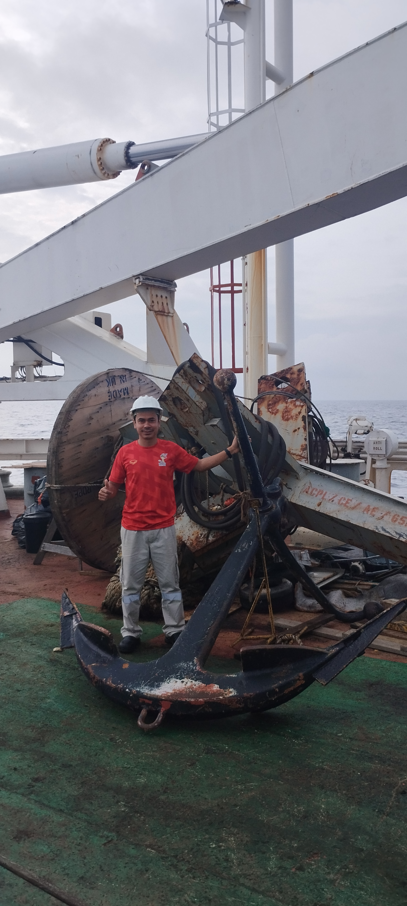

# Subsea Knowledge Base – Piyapong D.

> A complete engineering guide for Submarine Cable Systems  
> Wet Plant • Dry Plant • Optical Transmission • PFE • Grounding • Marine Ops • NOC • Fault Handling

---

## 📘 Knowledge Sections
- [Phase 1 – Foundation](phase1.md)
- [Phase 2 – Intermediate](phase2.md)
- [Phase 3 – Advanced](phase3.md)

---

## 📗 PFE & Grounding Systems
- [Subsea Power System Overview](subsea-power-system.md)
- [PFE – Feeding Modes & Earth Systems](earth-systems.md)
- [PFE – Fault & SLM Diagnostics](pfe-power-grounding.md)
- [PFE Power Theory](pfe-power-theory.md)

---

## 🔵 Optical Transmission Systems
- [Transponder & DWDM Transmission](transponder-transmission.md)
- [Modulation Formats (QPSK / QAM)](modulation.md)
- [Constellation & Impairment Analysis](constellation-analysis.md)
- [Coherent Signal Processing & DSP](coherent-processing.md
- [Optical Performance & Monitoring](optical-performance.md)
- [Nonlinear Effects in Subsea Systems](nonlinear-effects.md)
- [SLTE Vendor Deep Guide (ASN / NEC / SubCom / HMN)](vendor-slte-guide.md)
- [Optical Budget & OSNR Calculators](optical-calculator.md)

---

## 🌊 Wet Plant Engineering
- [Wet Plant – Repeater, BU, Cable Structure](wet-plant-engineering.md)

---

## 🛠 Fault Casebook (Troubleshooting)
- [Casebook – Ground Fault, Pump Fail, BU Issues](fault-casebook.md)

---

## 🚢 Marine & Field Operations
- [Marine Operations – Cable Ship Handbook](marine-operations.md)
- [Field Operation Gallery](gallery.md)

---

## 🌐 Network Architecture
- [End-to-End Transport Path](subseaendtoend.md)
- [Traffic Engineering for Subsea Networks](traffic-engineering.md)

---

## 📙 Glossary
- [Subsea Glossary A–Z](glossary.md)

---

  

