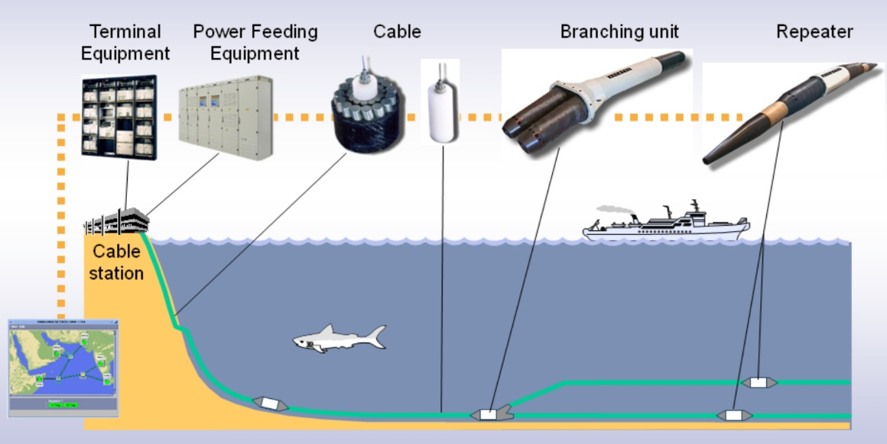

<a href="index.html" style="text-decoration:none; font-size:16px; color:#0066da;">? Back to Home</a>

# 🟧 Phase 1 – Foundation (พื้นฐาน Subsea)

เหมาะสำหรับ: คนใหม่, ฝึกงาน, และผู้ที่ต้องการต่อยอดความเข้าใจระบบ Submarine Cable ทั้งระบบ

---

# 1) ภาพรวมระบบ Subsea (System Overview)

การเข้าใจ “ภาพใหญ่ทั้งหมด” ของระบบเคเบิลใต้น้ำ ตั้งแต่จุดเริ่มต้นจนถึงจุดปลาย  
ระบบ Subsea แบ่งเป็น 3 ส่วนหลัก:

---

## 🌊 1. Wet Plant (อุปกรณ์ใต้น้ำ)

ประกอบด้วย:

- Fiber optic cable  
- Repeaters (EDFA ใต้น้ำ)  
- Branching Units (BU)  
- Underwater ROADM/WSS *(บางระบบรุ่นใหม่ เช่น APG)*  

**หน้าที่:**  
ส่งสัญญาณแสงระยะไกล **1,000–10,000 km**

---

## 🏢 2. Dry Plant (อุปกรณ์บนฝั่ง / CLS)

ประกอบด้วย:

- SLTE (Transponders, Line Cards → Coherent 100G/200G)  
- PFE (Power Feeding Equipment ±1.5–10 kV DC)  
- Monitoring (OSNR, Q-factor, PM/Alarms, OTDR, SLM)

**หน้าที่:**  
ส่งสัญญาณเข้า–ออก wet plant และจ่ายไฟให้ repeater chain

---

## 🏠 3. Landing Station (CLS)

จุดรวมการควบคุมระบบทั้งหมด ทั้งไฟฟ้า คลื่นแสง และ Backhaul

ประกอบด้วย:

- ระบบไฟฟ้า  
- ระบบคลื่นแสง  
- ระบบ Backhaul  
- ระบบ Monitoring  
- เชื่อมต่อ APG / CSN / International  

---

# 2) โครงสร้างสายเคเบิล, Repeaters และ CLS

---

## 🧵 โครงสร้างสายใต้น้ำ (Submarine Cable Structure)

ประเภทสาย:

1. Lightweight (กลางทะเลลึก)  
2. Lightweight Protected  
3. Single Armored  
4. Double Armored (โซน near-shore)

**วัสดุประกอบ:**

- Optical fibers  
- Copper conductor (นำไฟจาก PFE)  
- Steel armors  
- Insulation layers  
- Waterproof barrier  

---

## 🔌 Repeaters (EDFA ใต้น้ำ)

- Pump laser: **980 nm หรือ 1480 nm**  
- Feeding: **Constant current feeding**  
- อายุงาน: **25–30 ปี**  
- Gain ต่อ span: **10–20 dB**

---

## 🏠 Landing Station (CLS)

ประกอบด้วย:

- Redundant power  
- Air-conditioning  
- Fire suppression  
- NOC monitoring  
- Backhaul → Core Network

---

# 3) มาตรฐานสำคัญ (ITU-T & ICPC)

---

## 📘 มาตรฐาน ITU-T G.97x Series (สายใต้น้ำ)

- **G.973** – Repeaterless system  
- **G.974** – Cable structure  
- **G.975 / G.975.1** – FEC  
- **G.976** – Unrepeatered DWDM  
- **G.977** – Repeatered submarine system  
- **G.978** – Amplifier spec *(รวมเข้า G.977)*

---

## 🌍 ICPC (International Cable Protection Committee)

ดูแลด้าน:

- ความปลอดภัยของสาย  
- เขตวางสาย  
- การหลีกเลี่ยงลากอวน / ทิ้งสมอ  
- มาตรฐานการปกป้องเส้นทางเคเบิล

---

# 🖼️ ภาพประกอบระบบ Subsea

  

---
